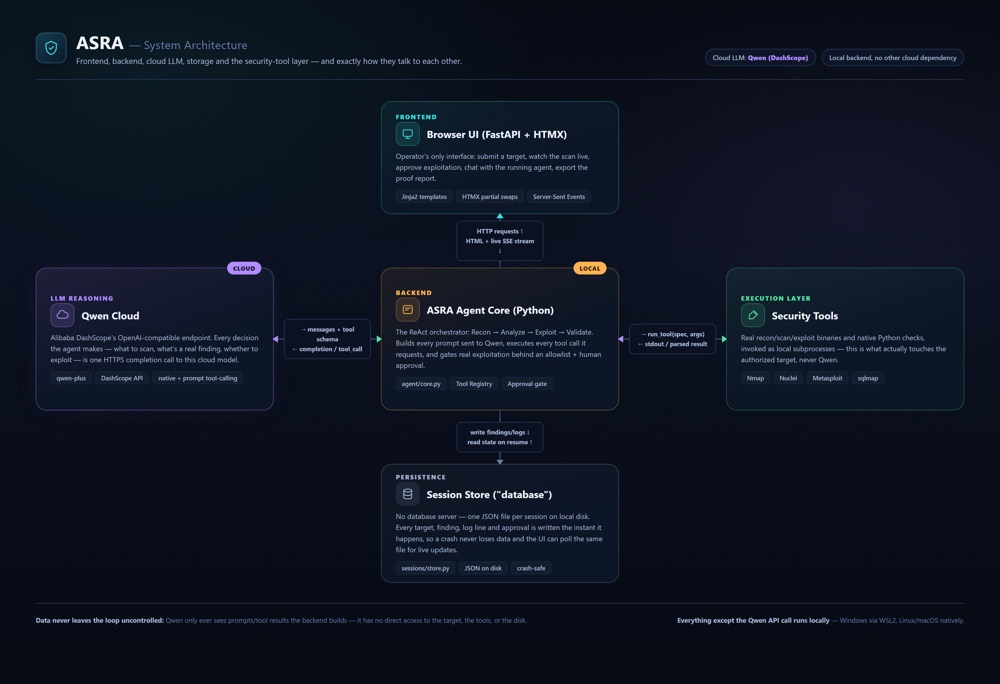
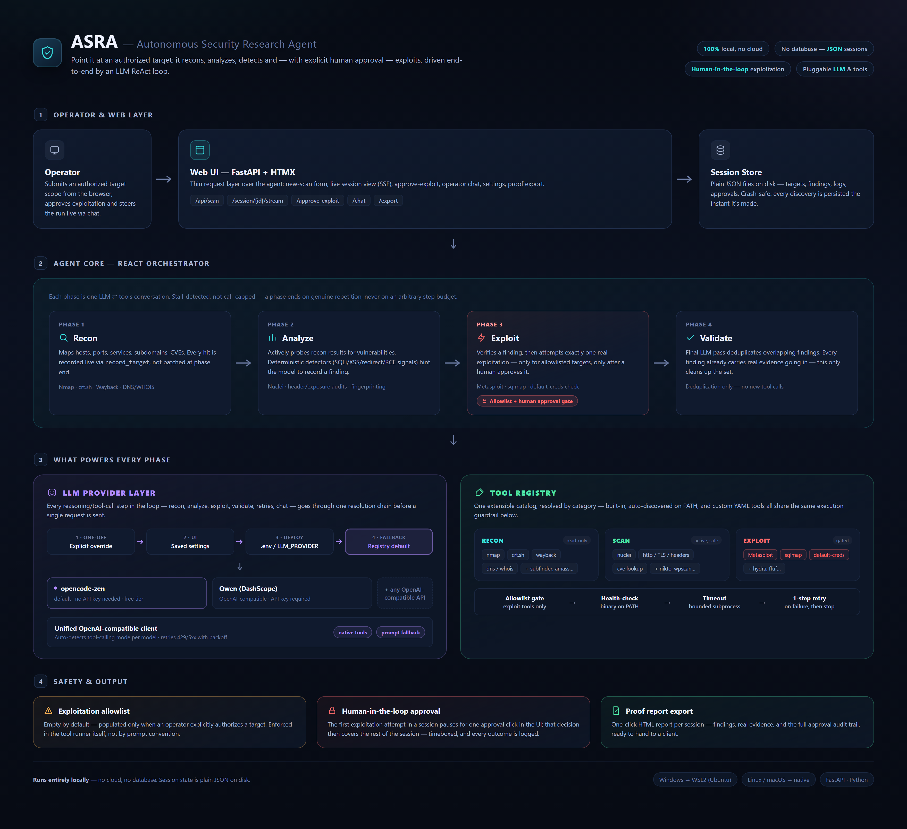

# ASRA
Autonomous Security Research Agent - ASRA

An autonomous pentesting agent: point it at an authorized target, and it recons, analyzes,
detects, and (with your explicit approval) exploits — driven by an LLM through a ReAct tool-calling
loop, with everything shown live in the browser. Runs entirely locally, no cloud/database — session
state is plain JSON files on disk.

## The problem

Authorized security testing is slow and expertise-heavy: a human has to manually run and interpret
a dozen different tools (Nmap, Nuclei, sqlmap, Metasploit, ...), chaining recon → analysis →
exploitation by hand, deciding the next step from each tool's raw output. That manual chaining —
not the tools themselves — is the actual bottleneck for small teams and solo researchers who need
frequent, fast, authorized assessments but can't spend a full day per target.

ASRA automates that chain end-to-end: an LLM plays the analyst, reading real tool output and
deciding what to run next through a ReAct loop (Recon → Analyze → Exploit → Validate) instead of a
human doing it step by step. A human stays the one decision-maker for anything that actually acts
on a target destructively — every real exploitation attempt is gated by an explicit allowlist and
still waits for an approval click before it runs. The result is the speed of automation without
giving up the judgment call on when it's actually safe to act.

## Features

- **ReAct pipeline** — an LLM drives four phases end-to-end (Recon → Analyze → Exploit → Validate),
  calling real tools at each step instead of just describing what it would do.
- **Live web UI** — the whole run streams to the browser over Server-Sent Events; no refresh, no
  polling.
- **Human-in-the-loop exploitation** — real exploitation (Metasploit, sqlmap, default-creds checks)
  only ever runs against an explicitly authorized target, and every attempt still waits for a
  per-session approval click in the UI.
- **Operator chat** — steer a running scan without restarting it: add guidance, skip a finding, or
  jump straight to a deep-dive on one.
- **Resumable sessions** — a crash or restart mid-scan doesn't lose progress; findings/logs are
  persisted the instant they're produced, and an interrupted session resumes from where it left off.
- **Pluggable LLM providers** — opencode-zen (default, free, no key) or Qwen (Alibaba DashScope)
  work out of the box; adding another OpenAI-compatible provider is one config row, no code changes.
- **Extensible tool registry** — built-in tools (Nmap, Nuclei, Metasploit, sqlmap) plus anything
  else already on `PATH` (subfinder, ffuf, nikto, hydra, ...) plus your own scripts via
  `custom_tools.yaml`.
- **Proof report export** — one click turns a completed session into a standalone HTML report:
  findings, real evidence, and the full human-approval audit trail.
- **Local-only** — no cloud dependency besides the LLM API call itself, and no database; session
  state is plain JSON on disk.

## Architecture

ASRA has five moving parts: a browser frontend, a Python backend that runs the ReAct loop, a cloud
LLM (Qwen, or any OpenAI-compatible provider) that makes every reasoning/tool-call decision, a
local execution layer that actually runs the security tools, and a JSON-file session store
standing in for a database. How they connect:



The ReAct pipeline itself, phase by phase, and what powers each one:



## How this runs on your OS

ASRA itself is plain Python (FastAPI). The reason it isn't "just run it natively everywhere" is
the security tools it drives — Nmap, Nuclei, Metasploit, sqlmap — which are Linux tools. What that
means per OS:

| Your OS | What actually runs ASRA | What you do |
|---|---|---|
| **Windows** | WSL2 (any distro) — ASRA does **not** run natively on Windows | Double-click **`run.bat`**. It finds WSL2 and runs `run.sh` inside it for you — you never have to open a WSL terminal yourself. First time on a fresh machine, do [Stage 1](#stage-1-prepare-your-machine-wsl2-and-security-tools) below first. |
| **Linux** | Native — no WSL involved, WSL doesn't exist here | Run **`bash run.sh`** directly in your normal terminal. |
| **macOS** | Native — no WSL, no Linux VM | Run **`bash run.sh`** directly in your normal terminal. Tool installs use Homebrew instead of `apt` (see [macOS section](#macos)) — this path is written carefully but not verified on physical Mac hardware, unlike the Linux/WSL2 path which is. |

`run.sh` is the actual worker in every case (Linux, macOS, and inside WSL2 on Windows) — it creates
the project-local venv, installs Python dependencies, and starts the server. `run.bat` is only a
Windows-side wrapper that hands off to it automatically. Whichever OS you're on, once the server is
up, open `http://localhost:8000` in your normal browser.

Getting from a fresh machine to a running ASRA is exactly **two stages**, always in this order:

1. **[Stage 1](#stage-1-prepare-your-machine-wsl2-and-security-tools) — prepare your machine.**
   Windows only: install WSL2. Then, on every OS: install the actual security tools (Nmap, Nuclei,
   Metasploit, sqlmap, nikto) that ASRA drives — one script for Linux/WSL2, Homebrew for macOS.
   Do this once per machine.
2. **[Stage 2](#stage-2-install-and-run-asra) — install and run ASRA itself.** Get the code, add
   your LLM API key, then run the one script that creates the Python environment, installs ASRA's
   own dependencies, and starts the server. Do this once to set up, then every time you want to
   start ASRA again.

## Stage 1: prepare your machine (WSL2 and security tools)

The goal of this whole stage is a machine where **nmap, nuclei, msfconsole, sqlmap, and nikto**
are all installed and on `PATH` — ASRA itself doesn't install or bundle any of these, it only
calls them. Nothing here is ASRA-specific yet; you'd set this up the same way for any tool that
drives Nmap/Metasploit/sqlmap. Do this once per machine, then move on to Stage 2.

### Windows only: set up WSL2 first

Skip straight to [Install the security tools](#install-the-security-tools-all-platforms) below if
you're on Linux or macOS, or if WSL2 + a distro are already installed on this Windows machine.

1. Open PowerShell **as Administrator** and run:
   ```powershell
   wsl --install
   ```
   This enables the WSL2 feature and installs Ubuntu (the current LTS) as your default distro in
   one step. Reboot if prompted. If you'd rather use a different distro or a specific version, list
   what's available with `wsl --list --online` and install it with `wsl --install -d <name>` instead
   — `run.bat` doesn't care which one you pick (see the distro note below).
2. On first launch, it will ask you to create a Unix username/password inside WSL2 — this is
   separate from your Windows login, pick anything.
3. Verify it worked:
   ```powershell
   wsl -- echo ok
   ```
   should print `ok`.
4. Continue to [Install the security tools](#install-the-security-tools-all-platforms) below —
   everything from here runs **inside** that WSL2 distro (a plain WSL2 terminal, or `run.bat`
   later on).

If `run.bat` reports "WSL is not installed or not on PATH", this step hasn't been completed yet.

**Which distro/version?** `run.bat` doesn't hardcode a distro name or version — it uses whichever
one WSL considers your *default* (`wsl --install` sets this automatically; check/change it with
`wsl --list` / `wsl --set-default <name>`). Any Debian/Ubuntu, Fedora/RHEL, or Arch based distro
works, since the only things `run.bat` itself needs inside WSL2 are `bash` and `wslpath` (both are
always present). `setup_tools.sh` (next) goes further — it detects and supports all three of those
package-manager families itself, so it doesn't matter which one you picked.
If you have **more than one** WSL distro installed and the default isn't the one you set up ASRA
in, tell `run.bat` which one to use:
```
set WSL_DISTRO=<your-distro-name>
run.bat
```
(list your installed distros with `wsl --list`).

### Install the security tools (all platforms)

Everyone ends up here — Windows (inside WSL2), Linux, and macOS all need this step; only *how*
you install differs.

#### Linux / WSL2 — any distro

```bash
bash setup_tools.sh
```

One script, safe to re-run any time (already-installed tools are detected and skipped, not
reinstalled). It detects your package manager (`apt`/`dnf`/`pacman` — Debian/Ubuntu, Fedora/RHEL,
or Arch, so it doesn't matter which distro your WSL2 is running) and installs the five core tools
the agent's registry expects on PATH: **nmap, nuclei, msfconsole (Metasploit), sqlmap, nikto**,
plus the Python venv/pip prerequisites `run.sh` itself needs. Nuclei has no distro package
anywhere, so it's always fetched from the latest official GitHub release regardless of distro;
sqlmap/nikto fall back to cloning their upstream repo directly if a given distro's repos don't
carry them. Run it once when setting up this machine, then re-run it any time you want to confirm
the arsenal is still intact (e.g. after `wsl --update` or switching distros) — it prints a summary table matching
exactly what the tool registry's own health-check (`shutil.which`) will see, so if `setup_tools.sh`
says a tool is ready, ASRA will find it too, no extra configuration needed.

Only for the five core tools above — see `agent/tools/discovery.py`/`KNOWN_TOOLS` for how the
registry auto-discovers *additional* recon/fuzz tools (e.g. `subfinder`, `ffuf`) if you install
those separately; they're optional extensions, not part of this script.

#### macOS

```bash
brew install nmap sqlmap git python3 nikto
brew install nuclei          # projectdiscovery/nuclei is in Homebrew core
brew install --cask metasploit
```

Not verified on physical Mac hardware — these are the standard Homebrew package/cask names for
each tool, but if a formula/cask has moved, check `brew search <tool>` or the tool's own site.
`setup_tools.sh` is Linux/WSL2-only (apt/dnf/pacman) — macOS uses Homebrew instead, hence the
separate manual list above.

**Stage 1 checkpoint** — before moving on, `nmap -V`, `nuclei -version`, `msfconsole -v`, `sqlmap --version`,
and `nikto -Version` should all print a version instead of "command not found". `setup_tools.sh`'s
own summary table (printed at the end of its run) already confirms this for you on Linux/WSL2.

## Stage 2: install and run ASRA

This is the part that's actually specific to ASRA — everything in Stage 1 was just getting the
underlying security tools onto the machine.

### Get the code

```bash
git clone <this-repo-url>
cd ASRA
cp .env.example .env   # then edit .env with a real LLM_PROVIDER API key (opencode-zen works with no key at all)
```

On Windows, do this once inside your WSL2 distro (a WSL terminal, or `wsl --` from PowerShell) —
`git clone` and editing `.env` only need to happen on the WSL2 filesystem side, since that's where
`run.sh`/`run.bat` will look for them.

### Install dependencies and start the server

Dependencies live in a **project-local virtual environment**, not your system Python — `run.sh`
(below) creates `./venv` and installs `requirements.txt` into it automatically, the first time and
every time you re-run it (it hashes `requirements.txt` and only reinstalls when that hash
changes, so re-running is always cheap). To do it by hand instead:

```bash
python3 -m venv venv
source venv/bin/activate
pip install -r requirements.txt
```

**Windows:** double-click `run.bat`, or run it from a normal `cmd`/PowerShell prompt:
```
run.bat
```
It locates WSL2, translates the project path, and runs `run.sh` inside your default WSL2 distro
for you (or a specific one, if you set `WSL_DISTRO` — see the distro note in Stage 1).

**Linux / macOS:**
```bash
bash run.sh
```
(Invoked as `bash run.sh` rather than `./run.sh` deliberately — a fresh `git clone` isn't guaranteed
to carry the executable bit on every filesystem, and `bash run.sh` works either way with no `chmod`
step needed.)

Either way this creates/updates `./venv`, installs dependencies, and starts the server on the port
from `.env` (`PORT`, default `8000`). Open `http://localhost:8000` in your browser — on Windows,
WSL2 forwards `localhost` to the Windows side automatically, no port-forwarding setup needed.

Equivalent manual start (once the venv is set up, inside WSL2/Linux/macOS):

```bash
source venv/bin/activate
uvicorn main:app --host 127.0.0.1 --port 8000
```

Standalone CLI (no web UI, runs one scan session directly):

```bash
python -m agent.core --target <authorized-target-from-the-table-below>
```

## Usage

Once the server is running and you've opened `http://localhost:8000`:

1. **New Project** — give it a name and one or more targets (comma-separated URLs/hosts/IPs), pick
   an LLM provider, and decide whether to authorize exploitation for this scope (checked by
   default — uncheck it for recon/detection only, no real exploitation at all).
2. **Watch it work** — the session page streams live: every target Recon finds and every finding
   Analyze records shows up the instant the agent reports it, no refresh needed.
3. **Approve exploitation** — when Exploit verifies a finding and wants to actually run something
   against it, the run pauses and waits for your click in the UI (times out to "skipped" if you
   don't respond in time — see `EXPLOIT_APPROVAL_TIMEOUT_SECONDS` below).
4. **Steer it live** — the chat box on the session page lets you nudge the agent (add guidance),
   tell it to skip a specific finding, or jump straight to a deep-dive on one, without restarting
   anything.
5. **Export proof** — once a session completes, "Export proof report" downloads a standalone HTML
   file with every finding, its real evidence, and the human-approval audit trail.
6. **Settings** (`/settings`) — switch the default LLM provider/model (applies to every new scan
   and the session chat) without touching `.env`, and pick a UI theme.

An interrupted session (e.g. the server restarted mid-scan) shows up on the sessions list
(`/sessions`) as *interrupted*, with a **Resume** button that picks the run back up from the last
completed phase instead of starting over.

## Configuration

Every runtime setting lives in `.env` — `.env.example` has the full list with inline explanations.
The ones worth knowing about going in:

| Variable | Default | What it does |
|---|---|---|
| `LLM_PROVIDER` | `opencode-zen` | Which provider to use — `opencode-zen` (free, no key) or `qwen` (needs `QWEN_API_KEY`) |
| `ENABLE_EXPLOIT` | `true` | `false` runs Recon + Analyze only — no exploitation phase at all, nothing to approve |
| `TOOL_TIMEOUT_SECONDS` / `EXPLOIT_TIMEOUT_SECONDS` | `600` / `600` | Per-call timeout for recon/scan tools vs. exploit tools |
| `EXPLOIT_APPROVAL_TIMEOUT_SECONDS` | `300` | How long a pending exploit waits for your approval click before it's skipped |
| `PROJECTS_DIR` | auto-detected | Where scan artifacts are saved; defaults to `Documents/ASRA Projects` per OS if unset |
| `DEBUG` | `false` | Verbose per-category logging to `data/debug.log` — see Development below |

The LLM provider/model can also be changed later from `/settings` without editing `.env` again.

## Development

Test suite (from inside the venv):
```bash
pytest
```

Lint:
```bash
ruff check .
```

Debug logging — set `DEBUG=true` in `.env` (or pass `--debug` to the standalone CLI) to turn on
verbose, per-category, colorized logging to `data/debug.log`. Useful when a tool call or LLM
response isn't doing what you expect.

## Test scope / Legal notice

This agent performs active scanning (Nmap, Nuclei), vulnerability probing, and — for the allowed
target only — real exploitation (Metasploit, sqlmap). To keep every run legal without standing up
a private lab, all test targets are **public applications that explicitly authorize security
testing**:

| Target | Role | Authorization |
|---|---|---|
| `juice-shop.herokuapp.com` | Recommended for the exploitation allowlist (see below) | OWASP Juice Shop — intentionally vulnerable app (SQLi/XSS/broken auth/IDOR, etc.) |
| `ginandjuice.shop` | Recon/Analyze demo variety | Official PortSwigger (Burp Suite) test target |
| `google-gruyere.appspot.com` | Recon/Analyze demo variety | Google — explicitly authorized attack target |
| `public-firing-range.appspot.com` | Recon/Analyze, XSS focus | Google — official automated-scanner test bed |

Rules that apply for all of the above:

- Recon/scan-category tools (Nmap, Nuclei, native recon tools) may run against any target submitted
  through the scan form, including all four above.
- **Real exploitation (Metasploit, sqlmap, `default_creds_check`) only ever runs against a target
  that you've explicitly authorized** — the "Authorize exploitation" checkbox on the New Project
  dialog (checked by default; uncheck it for recon/detection only). That allowlist is stored in
  `data/allowed_targets.json` and is **empty until a project actually authorizes something** —
  it's never populated from `.env` or by the LLM itself; enforced as a hard guardrail in the tool
  runner (`agent/tools/runner.py`), not just by convention or a prompt instruction. In addition,
  every individual exploitation attempt still requires a separate human-in-the-loop approval in
  the session UI before it runs.
- These are shared public targets used by many other people for the same purpose — the agent must
  not hammer them with unnecessary aggressive Nuclei templates or fuzzing; only what a given demo
  scenario actually needs.
- No other domain is in scope. The agent is not authorized to scan or exploit anything outside this
  table.

## License

MIT — see [LICENSE](LICENSE).
