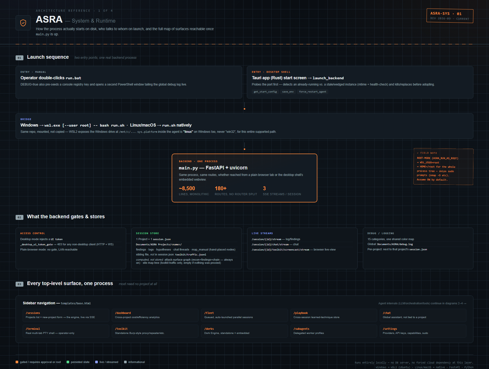
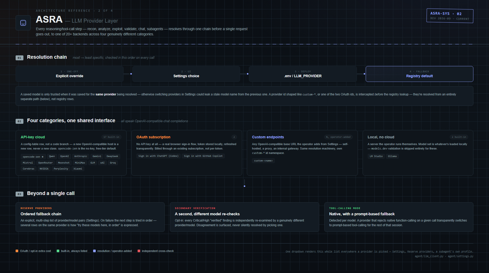
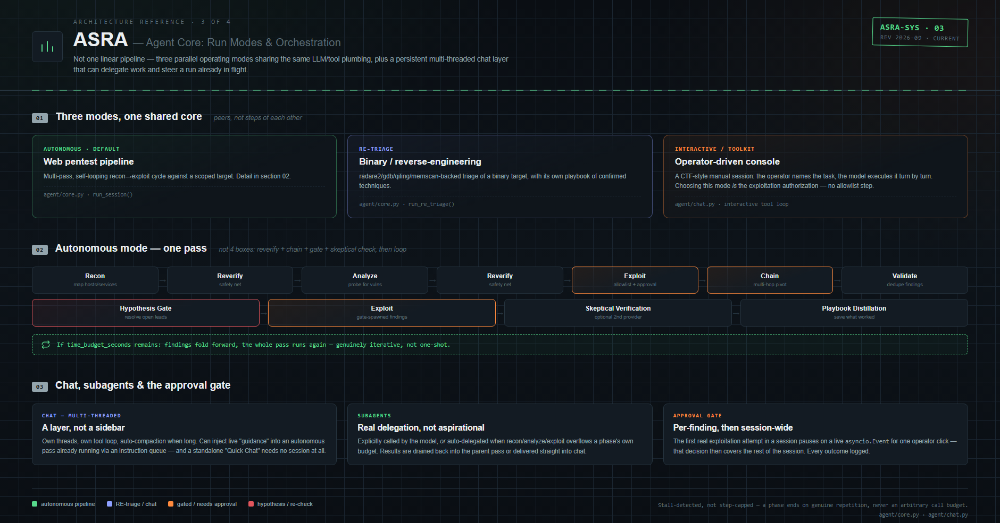
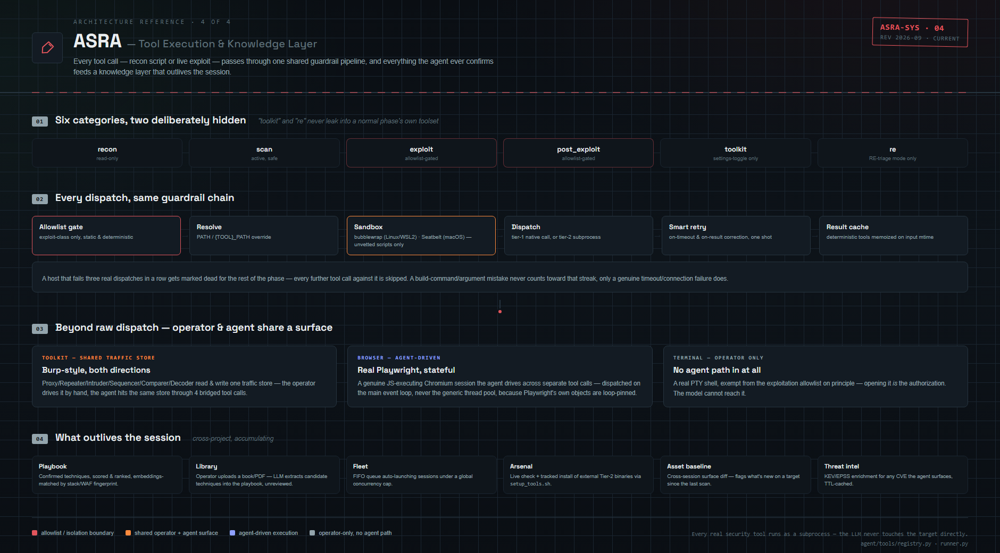

# ASRA
Autonomous Security Research Agent - ASRA

[](LICENSE)

An autonomous pentesting agent: point it at an authorized target, and it recons, analyzes,
detects, and exploits — driven by an LLM through a ReAct tool-calling loop, with everything shown
live in the browser. Runs entirely locally, no cloud/database — session state is plain JSON files
on disk.

## Who ASRA is for

ASRA is built to be useful across the whole spectrum of authorized offensive-security work, from
full-time professionals to people just getting started:

- **Bug bounty hunters** — automate the repetitive recon → analyze → exploit grind on programs
  you're already scoped and authorized for, and walk away with a Proof report (findings + real
  evidence + audit trail) ready to attach to a submission.
- **OSINT researchers** — the recon phase (Subfinder, amass, and friends) maps attack surface —
  subdomains, exposed services, tech fingerprints — without hand-chaining a dozen tools yourself.
- **Professional penetration testers / red teamers** — allowlist-gated, fully audit-logged
  exploitation you can point at a real, authorized engagement, with an optional per-attempt human
  approval gate (`EXPLOIT_REQUIRE_APPROVAL=true`) when you want to stay the final decision-maker.
- **Security researchers and CTF players** — run it against labs, CTF boxes, or the built-in
  approved demo targets (OWASP Juice Shop, PortSwigger's `ginandjuice.shop`, Google Gruyere, etc.)
  to study how an automated exploitation chain actually reasons, finding by finding.
- **Cybersecurity students and hobbyists** — the ReAct loop's reasoning streams live in the
  browser, so you can see *why* the agent picked one tool or finding over another instead of just
  the final result — a way to learn tool-chaining logic without years of manual practice first.
- **Small teams and solo operators** — anyone who needs frequent, fast, authorized assessments but
  can't spend a full day per target manually chaining tools by hand.
- **Security engineers evaluating LLM-driven tooling** — a working, source-available example of an
  LLM orchestrating real security tools through a ReAct loop, if you're building or assessing
  similar agentic tooling yourself.

None of this is a substitute for authorization — every use case above assumes you already have
explicit permission to test the target in question. See [Disclaimer](#disclaimer) and
[Test scope / Legal notice](#test-scope--legal-notice) below.

## The problem

Authorized security testing is slow and expertise-heavy: a human has to manually run and interpret
a dozen different tools (Nmap, Nuclei, sqlmap, Metasploit, ...), chaining recon → analysis →
exploitation by hand, deciding the next step from each tool's raw output. That manual chaining —
not the tools themselves — is the actual bottleneck for small teams and solo researchers who need
frequent, fast, authorized assessments but can't spend a full day per target.

ASRA automates that chain end-to-end: an LLM plays the analyst, reading real tool output and
deciding what to run next through a ReAct loop (Recon → Analyze → Exploit → Validate) instead of a
human doing it step by step. Every real exploitation attempt is gated by an explicit allowlist —
that check always applies, no matter what — and runs fully autonomously by default (every decision
still recorded in the audit trail Export Proof relies on). Set `EXPLOIT_REQUIRE_APPROVAL=true` if
you'd rather stay the one decision-maker for anything that acts on a target destructively, pausing
each exploit attempt for a per-session approval click in the UI instead.

## Features

- **ReAct pipeline, not a fixed script** — Recon → Analyze → Exploit → Validate is the backbone,
  but a real pass also reverifies its own findings, chains multi-hop pivots, and loops back for
  another pass while time budget remains — the LLM calls real tools and reacts to their actual
  output at every step, never just describing what it would do. See [Architecture](#architecture)
  below for the full shape.
- **Live web UI** — the whole run streams to the browser over Server-Sent Events; no refresh, no
  polling.
- **Allowlist-gated, autonomous-by-default exploitation** — real exploitation (Metasploit, sqlmap,
  default-creds checks) only ever runs against an explicitly authorized target; by default it fires
  immediately (auto-approved, still fully logged in the audit trail) — set
  `EXPLOIT_REQUIRE_APPROVAL=true` to add a per-session human approval click before each attempt.
- **Operator chat** — steer a running scan without restarting it: add guidance, skip a finding, or
  jump straight to a deep-dive on one.
- **Resumable sessions** — a crash or restart mid-scan doesn't lose progress; findings/logs are
  persisted the instant they're produced, and an interrupted session resumes from where it left off.
- **Pluggable LLM providers** — opencode-zen (default, free, no key), Qwen, Mistral, and
  OpenRouter work out of the box, plus local providers (LM Studio, Ollama) for running entirely
  offline; adding another OpenAI-compatible provider is one config row, no code changes.
- **Extensible tool registry** — built-in tools (Nmap, Nuclei, Metasploit, sqlmap, Nikto, WhatWeb,
  Wpscan, Dalfox, ffuf, Subfinder, Arjun, Hydra) plus anything else already on `PATH` (amass,
  gobuster, ...) plus your own scripts via `custom_tools.yaml`. Arjun is the one exception to
  "installed by `setup_tools.sh`" — it's a pure-Python tool, installed like any other Python
  dependency via `requirements.txt`/`run.sh`, no separate WSL step needed.
- **Real credential brute-forcing, without blocking the agent** — Hydra (network services:
  SSH/FTP/telnet/MySQL/PostgreSQL/RDP/SMB) and a purpose-built CSRF-aware web-login brute-forcer
  (for login forms Hydra's own static-request-body approach can't get past) both run as real
  background jobs: `hydra_start`/`web_login_bruteforce_start` return immediately with a job ID, and
  the agent keeps working on other findings while `background_job_check` polls for the result. A
  real empirical preflight (a few deliberately wrong logins, checking for an actual lockout/CAPTCHA/
  rate-limit signal) runs first — an undefended target gets a real attempt, a defended one gets a
  clean skip instead of a blind guess. Same allowlist + (by default autonomous) approval gate as
  every other exploit tool.
- **Wordlist catalog** — the Settings page's "Wordlists" section auto-detects every wordlist
  already on disk under the locations `setup_tools.sh` itself manages (SecLists picks, rockyou.txt,
  the ffuf default, Metasploit's own bundled lists), with real line counts/sizes, not just a static
  list. A "Download wordlist" field fetches any URL you paste straight into a local catalog entry
  (streamed with a hard size cap — no ToolSpec, so this is a human-only action, never something the
  agent can call). Each tool that takes a wordlist (ffuf, Arjun, Hydra's usernames/passwords,
  web_login_bruteforce's usernames/passwords) can be pointed at a specific catalog entry from a
  dropdown — an explicit model-supplied wordlist still always wins over the assignment, and a stale
  assignment (the file got moved/deleted outside the app) cleanly falls back to that tool's own
  built-in default instead of breaking the run.
- **Subagents** — named, pre-configured worker profiles (own allowed-tool checklist, own
  instructions/personality, optionally their own LLM provider/model), managed from the **Subagents**
  tab. While a scan is running, the main agent can hand a bounded, self-contained sub-task to an
  enabled subagent via `delegate_to_subagent` and immediately keep working on something more
  important itself — it never blocks waiting, except right before concluding a phase if that
  subagent hasn't finished yet. The subagent runs as a genuinely concurrent background LLM
  conversation (not a subprocess) and pushes its own result back automatically once done;
  `check_subagent_task` is only an explicit fallback for the rare case that push doesn't land. A
  separate **Tools** tab shows every registered tool and whether it's actually installed on this
  machine right now — the same live check feeds the Subagents tab's tool checklist, so a profile
  can only ever be given tools that genuinely exist here.
- **Proof report export** — one click turns a completed session into a standalone HTML report:
  findings, real evidence, and the full human-approval audit trail.
- **Local-only** — no cloud dependency besides the LLM API call itself, and no database; session
  state is plain JSON on disk.

## Architecture

ASRA isn't one linear pipeline — a browser/desktop frontend talks to a single local FastAPI
backend, which resolves every reasoning/tool-call step through a pluggable LLM provider layer (20+
backends across API-key, OAuth, custom and local), executes tools through one shared guardrail
pipeline, and persists both session state and cross-session knowledge (playbook, library, fleet)
as plain JSON on disk — no database. Four diagrams cover it end to end:

**System & runtime** — how the process actually launches (desktop shell / WSL2 bridge), what the
backend gates and stores, and every top-level surface reachable once it's up:



**LLM provider layer** — the resolution chain, and the four genuinely different categories of
backend it can resolve to:



**Agent core — run modes & orchestration** — the three parallel operating modes (autonomous
pipeline, RE-triage, interactive/toolkit), the real non-linear autonomous pass, and the
chat/subagent/approval-gate layer:



**Tool execution & knowledge layer** — the shared guardrail pipeline every tool call passes
through, and what accumulates across sessions:



## How this runs on your OS

ASRA itself is plain Python (FastAPI). The reason it isn't "just run it natively everywhere" is
the security tools it drives — Nmap, Nuclei, Metasploit, sqlmap — which are Linux tools. What that
means per OS:

| Your OS | What actually runs ASRA | What you do |
|---|---|---|
| **Windows** | WSL2 (any distro) — ASRA does **not** run natively on Windows | Double-click **`run.bat`**. It finds WSL2 and runs `run.sh` inside it for you — you never have to open a WSL terminal yourself. First time on a fresh machine, do [Stage 1](#stage-1-prepare-your-machine-wsl2-and-security-tools) below first. |
| **Linux** | Native — no WSL involved, WSL doesn't exist here | Run **`bash run.sh`** directly in your normal terminal. |
| **macOS** | Native — no WSL, no Linux VM | Run **`bash run.sh`** directly in your normal terminal. Tool installs use Homebrew instead of `apt` (see [macOS section](#macos)) — this path is written carefully but not verified on physical Mac hardware, unlike the Linux/WSL2 path which is. |

`run.sh` is the actual worker in every case (Linux, macOS, and inside WSL2 on Windows) — it creates
the project-local venv, installs Python dependencies, and starts the server. `run.bat` is only a
Windows-side wrapper that hands off to it automatically. Whichever OS you're on, once the server is
up, open `http://localhost:8000` in your normal browser.

Getting from a fresh machine to a running ASRA is exactly **two stages**, always in this order:

1. **[Stage 1](#stage-1-prepare-your-machine-wsl2-and-security-tools) — prepare your machine.**
   Windows only: install WSL2. Then, on every OS: install the actual security tools (Nmap, Nuclei,
   Metasploit, sqlmap, nikto) that ASRA drives — one script for Linux/WSL2, Homebrew for macOS.
   Do this once per machine.
2. **[Stage 2](#stage-2-install-and-run-asra) — install and run ASRA itself.** Get the code, add
   your LLM API key, then run the one script that creates the Python environment, installs ASRA's
   own dependencies, and starts the server. Do this once to set up, then every time you want to
   start ASRA again.

## Stage 1: prepare your machine (WSL2 and security tools)

The goal of this whole stage is a machine where **nmap, nuclei, msfconsole, sqlmap, nikto,
whatweb, wpscan, dalfox, ffuf, subfinder, and hydra** are all installed and on `PATH` — ASRA itself
doesn't install or bundle any of these, it only calls them. Nothing here is ASRA-specific yet;
you'd set this up the same way for any tool that drives Nmap/Metasploit/sqlmap. Do this once per
machine, then move on to Stage 2.

This stage also downloads **Chromium for Playwright** — the headless-browser tools
(`browser_navigate`/`browser_click`/... — `agent/tools/browser_manager.py`) that let the agent
actually see JS-rendered content (SPAs, DOM-based XSS, client-side auth flows) instead of only the
raw HTTP response every other tool is limited to. Unlike everything above, this isn't a system
package — it's a pip package (already in `requirements.txt`, installed automatically into `venv`
by Stage 2) plus a separate ~150MB browser download `setup_tools.sh` fetches below. Optional in the
sense that the rest of ASRA works fine without it (those 9 tools just report themselves
not-installed and the agent falls back to `http_request`/`view_source`), but recommended — most
real-world targets are JS-rendered apps this closes a real blind spot for.

**Everything in this whole stage is genuinely optional, not a hard requirement to start ASRA at
all.** Every external tool here reports itself as `tool_unavailable` if it isn't on `PATH` — the
agent just adapts, falling back to native Python tools that ship with ASRA and need nothing
installed (`http_request`, `dns_lookup`, `whois`, `crt_sh_lookup`, `wayback_urls`,
`common_crawl_urls`, `shodan_internetdb_lookup`, `view_source`, and more). You can `bash run.sh`
straight from a fresh clone with zero tools from this stage installed and get a working, if
weaker, recon-only agent — useful for trying ASRA out before committing to the full ~6-8 GB
arsenal, or on a machine you deliberately want to keep light. Nothing ever hard-fails for a missing
tool; you just get fewer, more basic techniques until you run Stage 1 (or the in-app installer
below) for real.

### Windows only: set up WSL2 first

Skip straight to [Install the security tools](#install-the-security-tools-all-platforms) below if
you're on Linux or macOS, or if WSL2 + a distro are already installed on this Windows machine.

1. Open PowerShell **as Administrator** and run:
   ```powershell
   wsl --install
   ```
   This enables the WSL2 feature and installs Ubuntu (the current LTS) as your default distro in
   one step. Reboot if prompted. If you'd rather use a different distro or a specific version, list
   what's available with `wsl --list --online` and install it with `wsl --install -d <name>` instead
   — `run.bat` doesn't care which one you pick (see the distro note below).
2. On first launch, it will ask you to create a Unix username/password inside WSL2 — this is
   separate from your Windows login, pick anything.
3. Verify it worked:
   ```powershell
   wsl -- echo ok
   ```
   should print `ok`.
4. Continue to [Install the security tools](#install-the-security-tools-all-platforms) below —
   everything from here runs **inside** that WSL2 distro (a plain WSL2 terminal, or `run.bat`
   later on).

If `run.bat` reports "WSL is not installed or not on PATH", this step hasn't been completed yet.

**Which distro/version?** `run.bat` doesn't hardcode a distro name or version — it uses whichever
one WSL considers your *default* (`wsl --install` sets this automatically; check/change it with
`wsl --list` / `wsl --set-default <name>`). Any Debian/Ubuntu, Fedora/RHEL, or Arch based distro
works, since the only things `run.bat` itself needs inside WSL2 are `bash` and `wslpath` (both are
always present). `setup_tools.sh` (next) goes further — it detects and supports all three of those
package-manager families itself, so it doesn't matter which one you picked.
If you have **more than one** WSL distro installed and the default isn't the one you set up ASRA
in, tell `run.bat` which one to use:
```
set WSL_DISTRO=<your-distro-name>
run.bat
```
(list your installed distros with `wsl --list`).

**Running as root (optional).** By default the agent runs as your WSL2 distro's normal, non-root
user — the documented, supported way. Root is only relevant for one thing right now: nmap's `-O`
OS-fingerprinting flag needs raw sockets, which needs root. Without it, `-O` is simply skipped and
the rest of the scan runs exactly as normal — never a hard failure. Two independent ways to get
`-O` working, pick whichever fits how your WSL2 user is set up:
- **Saved sudo password** (Settings → Optional interpreters/compilers, in the app itself) — not
  nmap-specific: the agent runs as your normal user, and any call that genuinely needs root (nmap
  `-O`, the in-app Arsenal installer below, an optional-interpreter install) uses `sudo` with this
  password when one is saved, falling back to passwordless `sudo`/a clear manual-command message
  otherwise. Stored in plain text in `.env` on this machine — see the double warning in Settings
  before saving one.
- **Run the whole agent as root** (no sudo/password involved anywhere, ever — no setup needed
  either: `root` (UID 0) always exists on every Linux distro by definition, and `wsl.exe --user
  root` switches to it directly with no password prompt at all — confirmed live, not assumed).
  Double-click **`run-root.bat`** instead of `run.bat` — same script, just with `WSL_USER=root`
  already baked in. (Equivalent by hand: `set WSL_USER=root` then `run.bat`, in case you'd rather
  toggle it per-launch instead of always using the separate `.bat`.)

### Install the security tools (all platforms)

Everyone ends up here — Windows (inside WSL2), Linux, and macOS all need this step; only *how*
you install differs.

#### Linux / WSL2 — any distro

```bash
bash setup_tools.sh
```

One script, safe to re-run any time (already-installed tools are detected and skipped, not
reinstalled). It detects your package manager (`apt`/`dnf`/`pacman` — Debian/Ubuntu, Fedora/RHEL,
or Arch, so it doesn't matter which distro your WSL2 is running) and installs the core tools the
agent's registry expects on PATH: **nmap, nuclei, msfconsole (Metasploit), sqlmap, nikto, whatweb,
wpscan, dalfox, interactsh-client, ffuf, subfinder, hydra**, plus the Python venv/pip prerequisites
`run.sh` itself needs. Nuclei, interactsh-client, dalfox, ffuf, and subfinder have no distro
package anywhere, so they're always fetched from the latest official GitHub release regardless of
distro; sqlmap/nikto/whatweb/wpscan fall back to cloning/gem-installing their upstream project
directly if a given distro's repos don't carry them. hydra falls back to a clear manual-install
message instead (unlike the others, it needs a real `./configure && make` C/C++ build whose
dependency chain varies too much across distros for this script to safely automate). `setup_tools.sh`
also installs a small default wordlist for ffuf (`/usr/share/wordlists/ffuf/common.txt`) so it has
something to run against out of the box — override with `FFUF_WORDLIST_PATH` for a bigger/custom
one. Run it once when setting up this machine, then re-run it any time you want to confirm the
arsenal is still intact (e.g. after `wsl --update` or switching distros) — it prints a summary
table matching exactly what the tool registry's own health-check (`shutil.which`) will see, so if
`setup_tools.sh` says a tool is ready, ASRA will find it too, no extra configuration needed.

Only for the tools above — see `agent/tools/discovery.py`/`KNOWN_TOOLS` for how the registry
auto-discovers *additional* recon/exploit tools (e.g. `amass`, `dnsx`, `httpx`, `gobuster`) if you
install those separately; they're optional extensions, not part of this script.

The same script also installs the Reverse Engineering project mode's own toolset: **radare2**
(plus the `r2ghidra` plugin, via `r2pm`, for decompilation, and `radiff2`, bundled with it),
**gdb**, **strace** (syscall/behavioral triage), **wine** (runs a Windows PE target directly for
dynamic analysis), **heimdall** (EVM bytecode decompilation — installed via its own official
`bifrost` installer, which needs a Rust/Cargo toolchain the script installs first via `rustup` if
it's missing), **upx** (packed-binary unpacking), **osv-scanner** and **trufflehog**
(source-repo dependency/secret scanning), **apktool** and **jadx** (Android APK decompilation),
**binwalk** (firmware analysis), **tshark** (packet capture — `dumpcap` is granted
`cap_net_raw`/`cap_net_admin` via `setcap` so live capture never needs root), and **scanmem**
(live-process memory scan/patch, the `memscan_*` tools — also grants it `cap_sys_ptrace` via
`setcap` so it can attach without running the whole agent as root; Linux-only, no macOS install
path for scanmem specifically). `slither`, `semgrep`, `pyevmasm` (Solidity analysis / SAST / EVM
disassembly), `frida` (dynamic instrumentation), `pwntools`, and `scapy` (exploit-primitive/packet
scripting for `custom_re_script`) are plain Python packages, installed into the venv automatically
by `run.sh` like every other dependency in `requirements.txt` — nothing extra to run for those six.

#### macOS

```bash
brew install nmap sqlmap git python3 nikto whatweb wpscan hydra
brew install radare2 gdb   # Reverse Engineering mode — the one part of setup_tools.sh that also
                            # runs on macOS (bash setup_tools.sh), everything else on this page is
                            # still the manual Homebrew list below. heimdall installs the same way
                            # on macOS as Linux (its own bifrost installer, run by setup_tools.sh).
brew install nuclei ffuf subfinder dalfox   # all projectdiscovery/hahwul tools are in Homebrew core
brew install --cask metasploit
```

Not verified on physical Mac hardware — these are the standard Homebrew package/cask names for
each tool, but if a formula/cask has moved, check `brew search <tool>` or the tool's own site.
interactsh-client has no Homebrew formula — download the `darwin` build directly from
https://github.com/projectdiscovery/interactsh/releases and put it on PATH. `setup_tools.sh` is
Linux/WSL2-only (apt/dnf/pacman) — macOS uses Homebrew instead, hence the separate manual list
above. ffuf also needs a wordlist on macOS — `setup_tools.sh`'s auto-installed one is Linux-only;
grab e.g. SecLists' `Discovery/Web-Content/common.txt` manually and point `FFUF_WORDLIST_PATH` at it.

Chromium/Playwright is the one exception that doesn't need Homebrew at all — `playwright install`
is cross-platform and handles macOS itself:
```bash
pip install "playwright==$(grep -oP '(?<=^playwright==)\S+' requirements.txt)"
playwright install chromium
```

**Stage 1 checkpoint** — before moving on, `nmap -V`, `nuclei -version`, `msfconsole -v`, `sqlmap --version`,
`nikto -Version`, `whatweb --version`, `wpscan --version`, `dalfox version`, `ffuf -V`,
`subfinder -version`, `hydra -h`, and `interactsh-client -version` should all print a version (or,
for hydra, its usage banner) instead of "command not found". `setup_tools.sh`'s own summary table (printed at the end of its run) already
confirms this for you on Linux/WSL2, including Chromium/Playwright.

### Alternative: install tools from inside the running app (Linux/WSL2 only)

You don't have to run `setup_tools.sh` by hand before ever starting ASRA — the **Tools** tab (once
the server is up, see Stage 2 below) has its own **Check arsenal** / **Install** buttons that run
this exact same live check and the exact same `setup_tools.sh`, from the browser, with the log
tailed live in the page as it runs (several minutes, ~6-8 GB download). Useful for a first-time
setup where you'd rather click through the app than open a terminal, or for confirming the arsenal
is still intact later without leaving the UI.

- **Check arsenal** is always available and never runs anything — it's the same
  `shutil.which`-based install check the agent itself makes before every tool call, broken down by
  mode (web-scan / reverse-engineering / HTTP toolkit) so you can see exactly which capability
  degrades without a given tool.
- **Install** needs root one way or another (same as running `setup_tools.sh` by hand would): if
  the server process is already root (`run-root.bat` / `WSL_USER=root`), it just runs; otherwise it
  uses a saved sudo password (Settings → Optional interpreters/compilers) if you set one, then
  falls back to passwordless `sudo` if that's configured on this machine, and if neither applies it
  shows you the exact `sudo bash setup_tools.sh` command to paste into a real terminal instead —
  it never prompts for a password inside the web page itself.
- **Linux/WSL2 only** — the button reports itself unsupported on native Windows or macOS, same
  scoping `setup_tools.sh` itself has (macOS still needs the manual Homebrew list above).

## Stage 2: install and run ASRA

This is the part that's actually specific to ASRA — everything in Stage 1 was just getting the
underlying security tools onto the machine.

### Get the code

```bash
git clone <this-repo-url>
cd ASRA
cp .env.example .env   # then edit .env with a real LLM_PROVIDER API key (opencode-zen works with no key at all)
```

On Windows, do this once inside your WSL2 distro (a WSL terminal, or `wsl --` from PowerShell) —
`git clone` and editing `.env` only need to happen on the WSL2 filesystem side, since that's where
`run.sh`/`run.bat` will look for them.

### Install dependencies and start the server

Dependencies live in a **project-local virtual environment**, not your system Python — `run.sh`
(below) creates `./venv` and installs `requirements.txt` into it automatically, the first time and
every time you re-run it (it hashes `requirements.txt` and only reinstalls when that hash
changes, so re-running is always cheap). To do it by hand instead:

```bash
python3 -m venv venv
source venv/bin/activate
pip install -r requirements.txt
```

**Windows:** double-click `run.bat`, or run it from a normal `cmd`/PowerShell prompt:
```
run.bat
```
It locates WSL2, translates the project path, and runs `run.sh` inside your default WSL2 distro
for you (or a specific one, if you set `WSL_DISTRO` — see the distro note in Stage 1). To run as
root instead of your normal WSL2 user, see "Running as root" in Stage 1 (`WSL_USER=root`).

**Linux / macOS:**
```bash
bash run.sh
```
(Invoked as `bash run.sh` rather than `./run.sh` deliberately — a fresh `git clone` isn't guaranteed
to carry the executable bit on every filesystem, and `bash run.sh` works either way with no `chmod`
step needed.) To run as root here, just invoke it as root directly (`sudo bash run.sh`, or already
being logged in as root) — no separate switch needed, unlike the WSL2 case above.

Either way this creates/updates `./venv`, installs dependencies, and starts the server on the port
from `.env` (`PORT`, default `8000`). Open `http://localhost:8000` in your browser — on Windows,
WSL2 forwards `localhost` to the Windows side automatically, no port-forwarding setup needed.

Equivalent manual start (once the venv is set up, inside WSL2/Linux/macOS):

```bash
source venv/bin/activate
python main.py
```

Standalone CLI (no web UI, runs one scan session directly):

```bash
python -m agent.core --target <authorized-target-from-the-table-below>
```

### Optional: the desktop app (native window)

Alongside the browser path above, ASRA has an **optional native desktop shell** — a small window
with a start screen where you pick **Desktop** or **Web** mode before launching. It launches the
backend for you, then either shows the UI right in the window (Desktop mode) or hands you the URL
to open in a browser (Web mode). It also adds a system tray (closing the window minimizes to the
tray so a long scan keeps running; **Quit** from the tray to actually stop) and a native OS
notification when a session finishes.

**Advanced launch settings, in that same start screen** — every `.env` variable gets its own row
here (a toggle/password/text field, inferred from the value), so provider API keys, the port,
`EXPLOIT_REQUIRE_APPROVAL`, the saved sudo password, and anything else in `.env.example` can all be
set before the backend ever starts, with no text-editor step. Two settings get their own dedicated
controls instead of a generic row: **Run the agent as root** (Windows/WSL2 only — see "Running as
root" above; the toggle exists but does nothing on a native Linux/macOS build of this shell, since
there's no WSL2 layer to target there) and the pre-launch intro animation's on/off + sound toggle.
If a previous launch is stuck (WSL2 itself wedged, not just the backend) the start screen also
surfaces a **Force restart ASRA** option that kills the stuck process/distro state and lets you
launch clean, without opening a terminal.

**It's optional and additive** — everything above (`run.bat` / `run.sh` + browser) keeps working
exactly the same. The shell lives in `desktop/src-tauri/` (a thin Tauri/Rust wrapper — it renders no
UI of its own; the whole pentest UI still comes from the Python/FastAPI backend). Build and run it:

```bash
cd desktop/src-tauri
cargo build --release            # needs Rust (rustup) + your OS's build tools
./target/release/asra-desktop    # Windows: asra-desktop.exe
```

- **Windows:** produces `asra-desktop.exe`; under the hood it spawns `run.sh` inside WSL2, same as
  `run.bat` does.
- **Linux:** build it inside WSL2 (or on native Linux) — same command, needs the Tauri system deps
  (`libwebkit2gtk-4.1-dev`, `build-essential`, `libssl-dev`, `libayatana-appindicator3-dev`,
  `librsvg2-dev`). It spawns `run.sh` directly.
- **macOS:** nothing in the code specifically blocks it (`spawn_backend` has a real non-Windows
  branch, and `tauri.conf.json` bundles a `.icns`), but nobody has actually built or run this shell
  on physical Mac hardware — unverified, not "impossible". Use the browser path above
  (`bash run.sh` + `http://localhost:8000`) as the confirmed-working Mac story unless you're willing
  to be the first to try `cargo build --release` there yourself.
- **Only the machine that BUILDS needs Rust.** A user running a pre-built binary does not — the exe
  is a ~9 MB self-contained launcher.
- The Rust build cache under `target/` is several GB; run `cargo clean` when you're done to reclaim it.
- In Desktop mode the UI is locked to the shell window via a per-launch token generated fresh at
  that launch, so a stray browser tab can't reach that backend; the plain browser/`run.bat` path is
  never gated. One edge case: if the shell detects an already-running backend and adopts it instead
  of starting a fresh one, that adopted instance keeps whatever gating (or lack of it) it already
  had — a token can only be set on a server this launch actually started.

## Usage

Once the server is running and you've opened `http://localhost:8000`:

1. **New Project** — give it a name and one or more targets (comma-separated URLs/hosts/IPs), pick
   an LLM provider, and decide whether to authorize exploitation for this scope (checked by
   default — uncheck it for recon/detection only, no real exploitation at all).
2. **Watch it work** — the session page streams live: every target Recon finds and every finding
   Analyze records shows up the instant the agent reports it, no refresh needed.
3. **Exploitation runs autonomously by default** — once Exploit verifies a finding, it fires
   immediately against anything in the allowlist (every decision still recorded in the audit
   trail). Set `EXPLOIT_REQUIRE_APPROVAL=true` if you'd rather the run pause and wait for your
   click in the UI before each attempt (times out to "skipped" if you don't respond in time — see
   `EXPLOIT_APPROVAL_TIMEOUT_SECONDS` below).
4. **Steer it live** — the chat box on the session page lets you nudge the agent (add guidance),
   tell it to skip a specific finding, or jump straight to a deep-dive on one, without restarting
   anything.
5. **Export proof** — once a session completes, "Export proof report" downloads a standalone HTML
   file with every finding, its real evidence, and the human-approval audit trail.
6. **Settings** (`/settings`) — switch the default LLM provider/model (applies to every new scan
   and the session chat) without touching `.env`, and pick a UI theme.

An interrupted session (e.g. the server restarted mid-scan) shows up on the sessions list
(`/sessions`) as *interrupted*, with a **Resume** button that picks the run back up from the last
completed phase instead of starting over.

## Configuration

Every runtime setting lives in `.env` — `.env.example` has the full list with inline explanations.
The ones worth knowing about going in:

| Variable | Default | What it does |
|---|---|---|
| `LLM_PROVIDER` | `opencode-zen` | Which provider to use — `opencode-zen` (free, no key), `qwen`, `mistral`, `openrouter` (each needs its own `*_API_KEY`), or a local `lmstudio`/`ollama` server (no key) |
| `ENABLE_EXPLOIT` | `true` | `false` runs Recon + Analyze only — no exploitation phase at all |
| `EXPLOIT_REQUIRE_APPROVAL` | `false` | `false` (default): exploitation proceeds autonomously the instant Exploit wants to run something (still fully logged in the audit trail). `true`: pause and wait for a per-session approval click in the UI before each attempt. The allowlist/scope check applies either way — this only gates the human-in-the-loop prompt |
| `LLM_REQUEST_TIMEOUT_SECONDS` | `120` | Per-call timeout for LLM API responses, before backoff retries kick in |
| `TOOL_TIMEOUT_SECONDS` / `EXPLOIT_TIMEOUT_SECONDS` | `600` / `600` | Per-call timeout for recon/scan tools vs. exploit tools |
| `EXPLOIT_APPROVAL_TIMEOUT_SECONDS` | `300` | Only relevant when `EXPLOIT_REQUIRE_APPROVAL=true` — how long a pending exploit waits for your approval click before it's skipped |
| `HYDRA_TIMEOUT_SECONDS` | `900` | How long a `hydra_start`/`web_login_bruteforce_start` background job is allowed to run before it's killed and marked `timeout` |
| `HYDRA_MAX_CONCURRENT_JOBS` | `2` | Max background brute-force jobs running at once per session — a further `hydra_start`/`web_login_bruteforce_start` call is skipped, not queued, until one finishes |
| `SUBAGENT_TASK_TIMEOUT_SECONDS` | `900` | How long a `delegate_to_subagent` task is allowed to run before it's cancelled and marked `timeout` |
| `SUBAGENT_MAX_CONCURRENT_TASKS` | `2` | Max delegated subagent tasks running at once per session — a further `delegate_to_subagent` call is skipped until one finishes |
| `PROJECTS_DIR` | auto-detected | Where scan artifacts are saved; defaults to `Documents/ASRA Projects` per OS if unset |
| `APP_DATA_DIR` | auto-detected | Where the global debug log is written; defaults to `Documents/ASRA` per OS if unset |
| `DEBUG` | `false` | Verbose per-category logging — see Development below |
| `INTERACTSH_CLIENT_PATH` | auto-detected | Override if `interactsh-client` isn't on PATH (blind SSRF/XSS confirmation) |

The LLM provider/model can also be changed later from `/settings` without editing `.env` again.

**What else lives on disk, and where** — beyond `.env`, ASRA stores API keys/OAuth tokens, the
exploitation allowlist, per-project credentials, and real scan data under `Documents/ASRA` /
`Documents/ASRA Projects` (see `PROJECTS_DIR`/`APP_DATA_DIR` above) — [SECURITY.md](SECURITY.md#data-asra-stores-locally-know-whats-on-disk)
has the complete, exact inventory, worth a read before sharing a debug log or a machine.

## Development

Test suite (from inside the venv):
```bash
pytest
```

Lint:
```bash
ruff check .
```

Debug logging — set `DEBUG=true` in `.env` (or pass `--debug` to the standalone CLI) to turn on
verbose, per-category, colorized logging: server/UI/agent activity not tied to one project goes to
a global log in `Documents/ASRA/debug.log`; anything tied to a specific scan session also gets its
own copy in that project's own folder, next to `session.json`. On Windows, `run.bat` also opens a
second, separate console window when `DEBUG=true`, tailing the global log live alongside the
server's own window. Useful when a tool call, LLM response, or UI interaction isn't doing what
you expect.

## Uninstalling / removing everything

ASRA keeps its own state in exactly two places outside the git checkout, plus whatever the
security tools themselves installed system-wide — nothing is scattered further than that:

- **One project** — the **Delete** button on a project's page (or on `/sessions`) removes that
  project's entire folder (findings, logs, chat threads, toolkit traffic, backups — everything
  scoped to that one engagement) plus its saved credentials file, if any. `/api/sessions/delete-all`
  (also reachable from the Projects list) does the same for every project at once.
- **All projects, done by hand instead** — every project folder lives under
  `Documents/ASRA Projects/` (or your `PROJECTS_DIR` override, see Configuration below) —
  deleting that whole folder is equivalent to deleting every project through the UI.
- **ASRA's own app-level state** (Settings choices, the exploitation allowlist, saved API
  keys/OAuth tokens, the playbook, wordlist catalog entries, the arsenal-install log) lives in
  `Documents/ASRA/` (or your `APP_DATA_DIR` override) — separate from your projects on purpose (see
  Configuration below), so deleting it resets ASRA to a fresh install without touching any project
  data, and vice versa.
- **The ASRA codebase itself** — just delete the folder you `git clone`d into. `./venv` (Python
  dependencies) lives inside it, so nothing else needs a separate uninstall step for that.
- **The desktop app's build cache** (`desktop/src-tauri/target/`, several GB if you built it) —
  `cargo clean` from inside `desktop/src-tauri`, same note as in that section above. A pre-built
  `asra-desktop`/`asra-desktop.exe` binary is just a file; delete it like any other.
- **The security tools `setup_tools.sh`/Homebrew installed system-wide** — there is currently **no
  automated uninstaller** for this (removing a live security toolchain safely, without touching
  something unrelated that happens to share a dependency, isn't something this project has
  automated). To remove them yourself: most were installed via your distro's package manager
  (`sudo apt remove nmap nikto whatweb hydra ...` / `dnf remove` / `pacman -R`, or `brew uninstall`
  on macOS) or Homebrew casks (`brew uninstall --cask metasploit`); the rest (nuclei,
  interactsh-client, dalfox, ffuf, subfinder, jadx, apktool, upx, osv-scanner, trufflehog, heimdall)
  were dropped as standalone binaries — `agent/tools/arsenal_install.py`'s own size-measurement list
  names the real install locations to check: `/opt/metasploit-framework`,
  `/usr/share/metasploit-framework`, `/usr/local` (most standalone binaries land under
  `/usr/local/bin`), `/usr/lib/.../wine`, `/opt/jadx`, `/usr/share/wordlists`,
  `/usr/share/seclists`, `/usr/lib/jvm`, `/usr/lib/radare2` / `/usr/share/radare2`,
  `~/.cache/ms-playwright` (Chromium), `~/.dotnet`, `~/.foundry` — `~` being `/root` if you ran
  everything as root, your normal WSL2/Linux user's home otherwise.
- **Windows/WSL2, the clean-sweep option** — since every tool above only ever lives *inside* your
  WSL2 distro, never on the Windows side, unregistering the whole distro removes ASRA's entire
  toolchain (and the ASRA checkout too, if you cloned it on the WSL2 filesystem rather than
  `/mnt/c/...`) in one step: `wsl --unregister <distro-name>` from PowerShell (see `wsl --list` for
  the name). This does not touch `Documents/ASRA`/`Documents/ASRA Projects` on the Windows side —
  those need the separate manual deletes above.

## Test scope / Legal notice

This agent performs active scanning (Nmap, Nuclei), vulnerability probing, and — for the allowed
target only — real exploitation (Metasploit, sqlmap). To keep every run legal without standing up
a private lab, all test targets are **public applications that explicitly authorize security
testing**:

| Target | Role | Authorization |
|---|---|---|
| `juice-shop.herokuapp.com` | Recommended for the exploitation allowlist (see below) | OWASP Juice Shop — intentionally vulnerable app (SQLi/XSS/broken auth/IDOR, etc.) |
| `ginandjuice.shop` | Recon/Analyze demo variety | Official PortSwigger test target |
| `google-gruyere.appspot.com` | Recon/Analyze demo variety | Google — explicitly authorized attack target |
| `public-firing-range.appspot.com` | Recon/Analyze, XSS focus | Google — official automated-scanner test bed |

Rules that apply for all of the above:

- Recon/scan-category tools (Nmap, Nuclei, native recon tools) may run against any target submitted
  through the scan form, including all four above.
- **Real exploitation (Metasploit, sqlmap, `default_creds_check`) only ever runs against a target
  that you've explicitly authorized** — the "Authorize exploitation" checkbox on the New Project
  dialog (checked by default; uncheck it for recon/detection only). That allowlist is stored in
  `data/allowed_targets.json` and is **empty until a project actually authorizes something** —
  it's never populated from `.env` or by the LLM itself; enforced as a hard guardrail in the tool
  runner (`agent/tools/runner.py`), not just by convention or a prompt instruction. This check
  always applies regardless of `EXPLOIT_REQUIRE_APPROVAL` — set that to `true` if you also want
  each individual exploitation attempt to pause for a separate human-in-the-loop approval in the
  session UI before it runs (the default is autonomous, still fully logged either way).
- These are shared public targets used by many other people for the same purpose — the agent must
  not hammer them with unnecessary aggressive Nuclei templates or fuzzing; only what a given demo
  scenario actually needs.
- No other domain is in scope. The agent is not authorized to scan or exploit anything outside this
  table.

## Disclaimer

ASRA is a tool for authorized security testing. It is provided "as is", with no warranty of any
kind — see the [LICENSE](LICENSE) for the full text. The author is not responsible for how other
users choose to use this software, including any unauthorized, illegal, or unethical use against
systems they do not own or do not have explicit written permission to test. Running active scans
or exploitation against a target you're not authorized to test may violate the law (e.g. the
CFAA in the US, the Computer Misuse Act in the UK, or equivalent legislation elsewhere) and the
target's own terms of service. You are solely responsible for obtaining proper authorization
before pointing ASRA at any target, and for complying with all applicable laws and agreements —
see [Test scope / Legal notice](#test-scope--legal-notice) above and [SECURITY.md](SECURITY.md)
for more.

## License

MIT — see [LICENSE](LICENSE).
